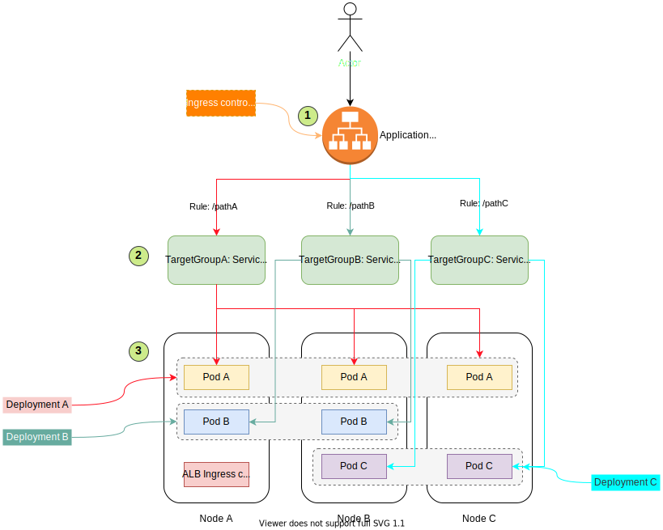
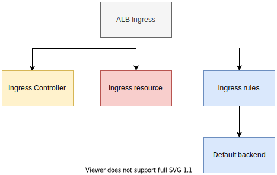
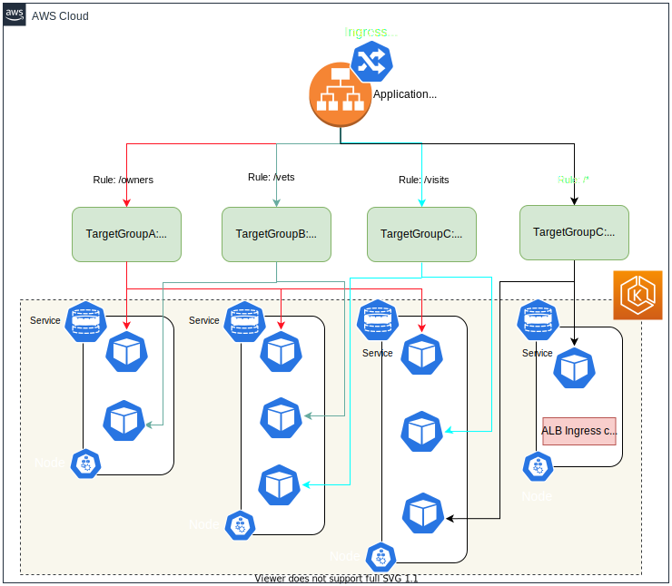
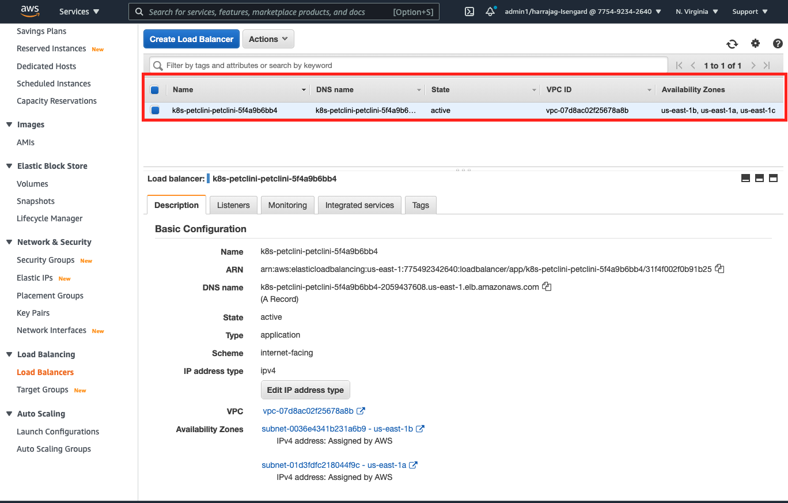
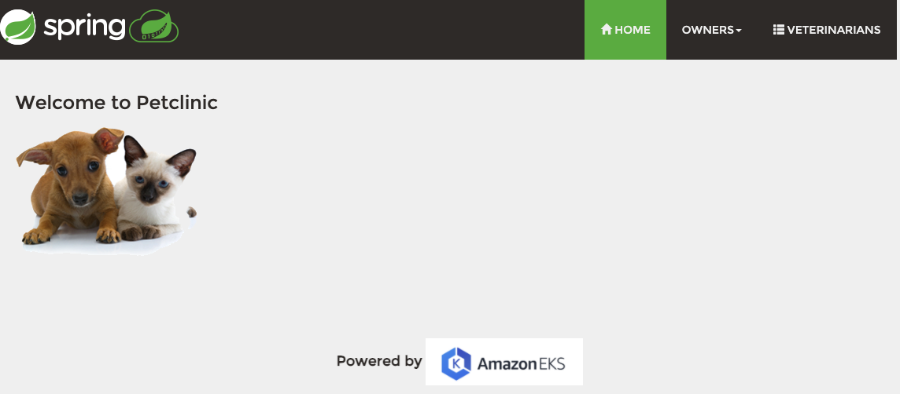

# Application load balancing Ingress on Amazon EKS

Part of this article we will see how to set up an EKS cluster with an ALB ingress controller and deploy applications that use path based routing available in AWS ALB to route traffic to different microservices.

## Ingress Overview

Ingress exposes HTTP and HTTPS routes from outside the cluster to services within the cluster. Traffic routing is controlled by rules defined on the Ingress resource.

An Ingress may be configured to give Services externally-reachable URLs, load balance traffic, terminate SSL / TLS, and offer name-based virtual hosting. An Ingress controller is responsible for fulfilling the Ingress, usually with a load balancer, though it may also configure your edge router or additional frontends to help handle the traffic.

Here is a simple example on how traffic flows from user to node with the equivalent kubernetes mappings represented in each of them



## Ingress Components

The following components are involved while setting up an application with ALB ingress



### Ingress controller

You must have an Ingress controller to satisfy an Ingress. Only creating an Ingress resource has no effect.
The cluster must have an ingress controller running.

Unlike other types of controllers which run as part of the kube-controller-manager binary, Ingress controllers are not started automatically with a cluster. Use this page to choose the ingress controller implementation that best fits your cluster.

Kubernetes as a project supports and maintains AWS, GCE, and nginx ingress controllers. In this article we will see how setup AWS based ALB Ingress, deploy applications and route traffic based on path based routing

### Ingress resource

Here is an example of an ingress resource:

```yaml
apiVersion: extensions/v1beta1
kind: Ingress
metadata:
  namespace: petclinic-namespace
  name: petclinic-ingress
  annotations:
    kubernetes.io/ingress.class: alb
    alb.ingress.kubernetes.io/scheme: internet-facing
    alb.ingress.kubernetes.io/healthcheck-port: "80"
    alb.ingress.kubernetes.io/healthcheck-path: "/actuator/health"
    alb.ingress.kubernetes.io/healthcheck-protocol: "HTTP"
    alb.ingress.kubernetes.io/target-type: "ip"    
spec:
  rules:
    - http:
        paths:
          - path: /owner*
            backend:
              serviceName: petclinic-customer-service
              servicePort: 80          
```

**Notes**

* As with all other Kubernetes resources, an Ingress needs `apiVersion`, `kind`, and `metadata` fields.
* The Ingress spec has all the information needed to configure a load balancer or proxy server. Most importantly, it contains a list of rules matched against all incoming requests. Ingress resource only supports rules for directing HTTP traffic.
* Ingress frequently uses annotations to configure some options depending on the Ingress controller, in this case we have used `healthcheck` annotations to define the health check path, port and protocol information.

### Ingress rules

Each http rule contains the following information:

* An optional host. In this example, no host is specified, so the rule applies to all inbound HTTP traffic through the IP address specified. If a host is provided (for example, foo.bar.com), the rules apply to that host.
* A list of paths (for example, `/owner`), each of which has an associated backend defined with a `serviceName` and `servicePort`. Both the host and path must match the content of an incoming request before the load balancer will direct traffic to the referenced service.
* A backend is a combination of service and port names as described as an kubernetes service. HTTP (and HTTPS) requests to the Ingress matching the host and path of the rule will be sent to the listed backend.

A default backend is often configured in an Ingress controller that will service any requests that do not match a path in the spec.

### Default Backend

An Ingress with no rules sends all traffic to a single default backend. The default backend is typically a configuration option of the Ingress controller and is not specified in your Ingress resources.

If none of the hosts or paths match the HTTP request in the Ingress objects, the traffic is routed to your default backend.

## AWS Application load balancer controller overview

AWS Load Balancer Controller is a controller to help manage Elastic Load Balancers for a Kubernetes cluster.

* It satisfies Kubernetes Ingress resources by provisioning Application Load Balancers.
* It satisfies Kubernetes Service resources by provisioning Network Load Balancers.

In this chapter we will focus on the Application Load Balancer.

AWS Elastic Load Balancing Application Load Balancer (ALB) is a popular AWS service that load balances incoming traffic at the application layer (layer 7) across multiple targets, such as Amazon EC2 instances, in multiple Availability Zones.

ALB supports multiple features including:

* Host or path based routing
* TLS (Transport Layer Security) termination, WebSockets
* HTTP/2
* AWS WAF (Web Application Firewall) integration
* Integrated access logs, and health checks

## Sample application overview

In order to better show the purpose of Ingress ALB we have created `Petclinic application` deployed inside AWS EKS which routes traffic using ALB ingress. It's a simple microservice application which provides a UI for new pet owners to register their pet, search for veterinarians, book appointments and keep track of all their doctor visits.

Here is the high level view of the architecture:



The application comprises four microservices, here are some details around each microservice

| Name  | Description |
| ----- | ------------- |
| petclinic-ui | Frontend/UI for petclinic application, used by end user |
| petclinic-customer | Backend service responsible for registering & managing pet owners |
| petclinic-vets | Backend service responsible for registering & managing veterinarians |
| petclinic-visits | Backend service responsible for managing appointments and recording visits |

**Technology stack**

| Usage  | Technology/Framework |
| ----- | ------------- |
| Frontend | HTML, CSS, Angular JS |
| Backend | Spring Boot, Hibernate |
| Database | MySQL |

* We deploy the application in a seperate namespace `petclinic-namespace`
* We wrap each microservice as an `container` within a `deployment` manifest
* Each `deployment` gets exposed as an `NodePort` kubernetes `service`
* We create ALB ingress resource with the `Ingress rules` to point to these exposed services
* AWS RDS Aurora (Mysql) gets used for storing and retrieving data. AWS secrets manager is used to store RDS credentials. We expose RDS credentials via kubernetes `env` variables (`SECRETS_NAME`) where the application uses secrets name to fetch the credentials and use it for connecting to database

# Build & Deployment

## Pre-requistes

* AWS CDK should be installed in the local laptop. You can read more about it [here](https://docs.aws.amazon.com/cdk/latest/guide/getting_started.html)
* Install `Kubectl`, more instructions available [here](https://kubernetes.io/docs/tasks/tools/)
* Install docker desktop, more instructions available [here](https://www.docker.com/products/docker-desktop)
* ```Yarn``` needs to be installed, you can check the installation status by running this command
* An AWS account with console and API access

```bash
yarn version
```

**Output**

1.22.10

If ```Yarn``` is not installed run the following command

```bash
npm install -g yarn
```

## Build

1. Check out the code from this repository using this command:

    ```bash
    mkdir alb-ingress-petclinic && cd alb-ingress-petclinic
    git clone git@ssh.gitlab.aws.dev:am3-app-modernization-gsp/eks/alb-ingress-petclinic.git .
    ```

2. Build the "Petclinic application" by running the following command from the root directory:

    ```bash
    cd src/petclinic
    mvn clean install    
    ```

    > Note: Source code for 'Petclinic application' is available under [src\petclinic](src/petclinic) folder

3. Create ECR repository for the microservices by running the following command from the root directory:

    ```bash
    cd src/petclinic
    ./create_repo.sh
    ```

    > Note: Four ECR repositories (ui, customer, vets, visits) will be created. Save the `repositoryUri` for each of these repositories

4. Create docker image and push them to ECR repositories by running the following command from the root directory:

    ```bash
    cd src/petclinic
    ./run.sh <repositoryUri-ui> <repositoryUri-customer> <repositoryUri-vets> <repositoryUri-visits>
    ```

    > Note: Make sure the `repositoryUri` are passed in the same order mentioned above. This will take care of packing these microservices and pushing the images to the corresponding ECR repositories

## Deploy

As the code is created as a CDK construct, they can be automatically imported to an existing CDK script

Code for the sample application using this construct is available in `src/integ.default.ts`. In order to deploy the application, first bootstrap a CDK environment (if you haven't done so already).

```bash
# Bootstrap CDK (ONLY ONCE, if you have already done this you can skip this part)
# Subsitute your AWS Account Id and AWS region in the command below
$ cdk bootstrap \
    --cloudformation-execution-policies arn:aws:iam::aws:policy/AdministratorAccess \
    aws://<AWS Account Id>/<AWS_REGION>
```

Run the following command to start the deployment, the following parameters can be customized as part of the deployment

| Parameter  | Description |
| ------------- | ------------- |
| uiImage | ECR UI Repository Image URI |
| customerImage | ECR Customer Repository Image URI |
| vetsImage | ECR Vets Repository Image URI |
| visitsImage | ECR Visits Repository Image URI |


```bash
cdk deploy --require-approval never
```

Once the deployment is successful you will see the following output:

```bash
npx: installed 9 in 1.732s
petclinic-stack: deploying...

 ✅  petclinic-stack (no changes)

Outputs:
petclinic-stack.PetClinicClustereksclusterClusterNameEE2AFAB8 = Cluster
petclinic-stack.PetClinicClustereksclusterConfigCommand8D84DE01 = aws eks update-kubeconfig --name Cluster --region us-east-1 --role-arn arn:aws:iam::775492342640:role/petclinic-stack-PetClinicClustereksclusterMastersR-1X46FK3X4KKZ9
petclinic-stack.PetClinicClustereksclusterGetTokenCommand1EDA242A = aws eks get-token --cluster-name Cluster --region us-east-1 --role-arn arn:aws:iam::775492342640:role/petclinic-stack-PetClinicClustereksclusterMastersR-1X46FK3X4KKZ9
petclinic-stack.PetClinicClustereksclusterMastersRoleArnA646E29D = arn:aws:iam::775492342640:role/petclinic-stack-PetClinicClustereksclusterMastersR-1X46FK3X4KKZ9

Stack ARN:
arn:aws:cloudformation:us-east-1:${aws-account-id}:stack/petclinic-stack/076e7950-82c9-11eb-bb21-12d806c7dd7d
```

> Note: The output will contain the `update-kubeconfig` command that needs to get executed in the command prompt in order to switch kubernetes context to this newly created EKS cluster.

CDK construct will take care of the following:

* Creation of EKS cluster
* Deployment of AWS ALB Ingress controller to EKS cluster
* Deployment of petclinic application which will in turn trigger creation of AWS application load balancer with target groups.

### Post Deployment

1. Setup kubernetes context - Open terminal or powershell and run the `update-config` command available in the CDK output to set the kubernetes context.

2. Get the load balancer URL - Login to AWS console and navigate to EC2 -> Load balancer. You should be able to see a load balancer created with the prefix k8s-petclinic*, like below:

    

3. Click on the load balancer, naviate to "Listeners" tab (bottom section) and click on "View/edit rules". Load balancer should the following rules registered

    

    > Note: If you dont see these rules registered run the following command under the root directory. It will create the load balancer with the ingress rules

    ```bash
    kubectl replace --force -f k8s/ingress-k8s.yaml
    ```

    **Output**
    ```bash
    ingress.extensions "petclinic-ingress" deleted
    ingress.extensions/petclinic-ingress replaced
    ```

4. Get the `DNS name` and use a web client like CURL or POSTMAN to send the following request

    ```bash
    POST: http://<<DNS name>>/owners/boostrap
    ```

    > Note: You should get a successful response with the HTTP code 200. This request will take care of bootstrapping petclinic database with sample data

## Verification

### Unit testing

Unit testcases can be executed by running the following command from the root directory

```bash
yarn test
```

**Output**

```bash
yarn run v1.22.10
$ npx projen test
🤖 test | rm -fr lib/
🤖 test » test:compile | tsc --noEmit --project tsconfig.jest.json
🤖 test | jest --passWithNoTests --all --updateSnapshot
 PASS  test/index.test.ts (5.769 s)
  ✓ create app (1758 ms)

----------|---------|----------|---------|---------|-------------------
File      | % Stmts | % Branch | % Funcs | % Lines | Uncovered Line #s
----------|---------|----------|---------|---------|-------------------
All files |     100 |       75 |     100 |     100 |
 index.ts |     100 |       75 |     100 |     100 | 445
----------|---------|----------|---------|---------|-------------------
Test Suites: 1 passed, 1 total
Tests:       1 passed, 1 total
Snapshots:   0 total
Time:        6.556 s
Ran all test suites.
🤖 test » eslint | eslint --ext .ts,.tsx --fix --no-error-on-unmatched-pattern src test build-tools .projenrc.js
✨  Done in 19.14s.
```

### Kubectl verification

Run the following command in the terminal to get the list of deployments

```bash
> kubectl get deployments -n petclinic-namespace
```

**Output**

The output will contain all the microservices along with the ALB ingress controller in `READY` state under `petclinic-namespace`

```bash
NAME                                                             READY   UP-TO-DATE   AVAILABLE   AGE
petclinic-customer                                               1/1     1            1           34h
petclinic-ui                                                     1/1     1            1           34h
petclinic-vets                                                   1/1     1            1           34h
petclinic-visits                                                 1/1     1            1           34h
ustereksclusterchartalbingresscontrollerchartdc1a7bff-aws-load   1/1     1            1           34h
```

### UI verification

Open the web browser and navigate to `http://${DNS name}` URL, you should be able to see the petclinic application. The web page will look like below:



# Cleanup

Run the following command from root directory to delete the stack

```bash
cdk destroy
```

# Resources

* [AWS EKS](https://aws.amazon.com/eks/)
* [AWS EKS CDK](https://docs.aws.amazon.com/cdk/api/latest/docs/aws-eks-readme.html)
* [Kubernetes Ingress](https://kubernetes.io/docs/concepts/services-networking/ingress/)
* [EKS workshop ALB Ingress](https://www.eksworkshop.com/beginner/130_exposing-service/ingress/)
* [Projen](https://www.npmjs.com/package/projen)